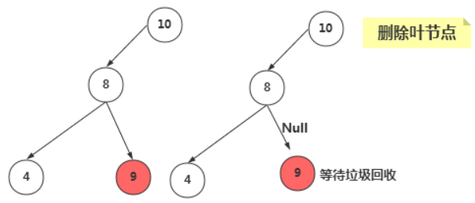
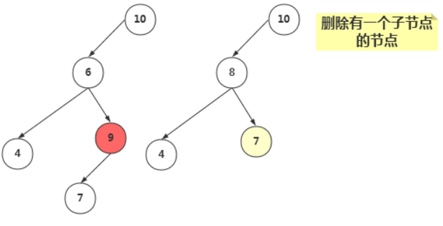
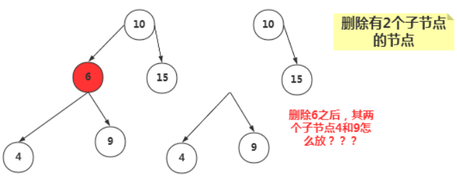
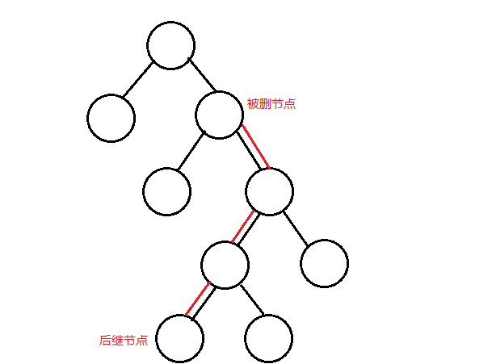
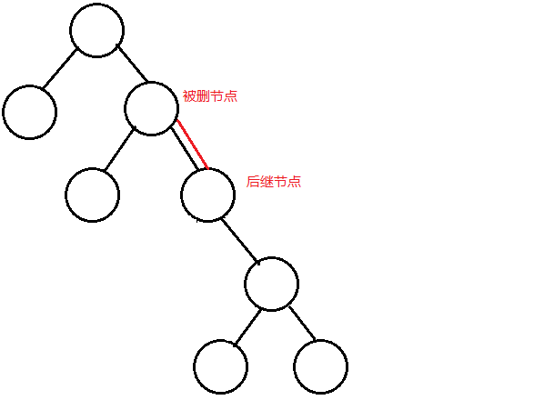
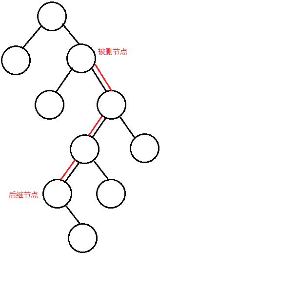

# 树

import java.util.LinkedList;

## 树的常用术语


* 路径：顺着节点的边从一个节点走到另一个节点，所经过的节点的顺序排列就称为“路径”。
* 根：树顶端的节点称为根。一棵树只有一个根，如果要把一个节点和边的集合称为树，那么从根到其他任何一个节点都必须有且只有一条路径。A是根节点。
* 父节点：若一个节点含有子节点，则这个节点称为其子节点的父节点；B是D的父节点。
* 子节点：一个节点含有的子树的根节点称为该节点的子节点；D是B的子节点。
* 兄弟节点：具有相同父节点的节点互称为兄弟节点；比如上图的D和E就互称为兄弟节点。
* 叶节点：没有子节点的节点称为叶节点，也叫叶子节点，比如上图的A、E、F、G都是叶子节点。
* 子树：每个节点都可以作为子树的根，它和它所有的子节点、子节点的子节点等都包含在子树中。
* 节点的层次：从根开始定义，根为第一层，根的子节点为第二层，以此类推。
* 深度：对于任意节点n,n的深度为从根到n的唯一路径长，根的深度为0；
* 高度：对于任意节点n,n的高度为从n到一片树叶的最长路径长，所有树叶的高度为0；

## 二叉树 二叉搜索树

* **二叉树**：
  * 树的每个节点最多只能有**两个子节点**
  * 二叉树的子节点称为“**左子节点**”和“**右子节点**”
* **二叉搜索树**：
  * 若它的左子树不空，则**左子树**上所有结点的值均**小于**它的**根结点**的值；
  * 若它的右子树不空，则**右子树**上所有结点的值均**大于**它的**根结点**的值；
  * 它的左、右子树也分别为二叉排序树。


## 查找节点

* 只能从根节点开始
* 查找值比当前节点值大,搜索右节点
* 查找的值等于当前节点的值,停止搜索
* 查找值比当前节点值小,搜索左节点

````java
public class TreeImpl implements Tree {
    public Node find(Integer key) {
        Node next= root;
        while (next!=null){
            if (next.getData()>key){//搜索值小于根节点,去左节点找
                    next = next.getLeftNode();
            }else if (next.getData()<key){
                    next = next.getRightNode();
            }else{
                return next;
            }
        }
        return null;
    }
}
````

## 插入节点

* 从根节点开始
* 大于根节点比较右节点,小于根节点比较左节点,知道左节点或者右节点为空,添加改节点
* 不能重复,重复可以在Node添加字段count,重复时count+1

```java
public boolean insert(Integer key) {
    Node newNode = new Node(key);//创建新的节点
    if (root==null){//根节点没有的话,在根节点添加
        root=newNode;
        return true;
    }

    Node nextNode = root;//根节点不为空
    //根节点有东西,比较大小,判断需要在左节点添加还是右节点,为空的话直接添加,相等的话返回false
    while (nextNode!=null){
        //判断是否相等
        if(nextNode.getData().equals(key)){//有重复值,可以选择count+1,也可以选择直接返回false,这里返回false,添加失败
            return false;
        }else if (nextNode.getData()>key){//节点值大于KEY,应该添加到左节点,为空的话直接添加,不为空的话,继续判断
            if (nextNode.getLeftNode()==null){
                nextNode.setLeftNode(newNode);
                return true;
            }
            nextNode = nextNode.getLeftNode();
        }else{
            if (nextNode.getRightNode()==null){
                nextNode.setRightNode(newNode);
                return true;
            }
            nextNode = nextNode.getRightNode();
        }
    }
    return true;
}
```

## 遍历节点

* 遍历有三种方式
  * **中序遍历**:左子树->根节点->右子树
  * **前序遍历**:根节点->左子树->右子树
  * **后序遍历**:左子树->右子树->根节点


```java
//遍历
public void infixOrder(Node current){//中序遍历
    if (current!=null){
        infixOrder(current.getLeftNode());
        System.out.print(current.getData()+" ");
        infixOrder(current.getRightNode());
    }
}
public void preOrder(Node current){//前序遍历
    if (current!=null){
        System.out.print(current.getData()+" ");
        preOrder(current.getLeftNode());
        preOrder(current.getRightNode());
    }
}
public void postOrder(Node current){//后序遍历
    if (current!=null){
        postOrder(current.getLeftNode());
        postOrder(current.getRightNode());
        System.out.print(current.getData()+" ");
    }
}
```

## 查找最大值与最小值

* **最小值**:一直往左子叶查找,直到为空
* **最大值**:一直往右子叶查找,直到为空

```java
//查找最大最小值
public Integer getMax(){
    if (root==null){
        return null;
    }
    Node current = root;
    while (current.getRightNode()!=null){
        current = current.getRightNode();
    }
    return current.getData();
}
public Integer getMin(){
    if (root==null){
        return null;
    }
    Node current = root;
    while (current.getLeftNode()!=null){
        current = current.getLeftNode();
    }
    return current.getData();
}
```

## 删除

* 节点的删除有三种情况(最复杂的为)
  * 要删除的节点没有子节点
  * 要删除的节点有一个子节点
  * 要删除的节点有两个子节点

**删除没有子节点的节点**
将父节点指向目标地址置为空即可



```java
//删除
public boolean delete(Integer key) {
    if (root==null){
        return false;
    }
    //找到该节点,以及父节点
    Node target = find(key);
    Node parent = findparent(key);
    if (target==null){        //判断是否为空
        return false;
    }

    //判断类型
    int count = 0;
    if (target.getLeftNode()!=null){
        count++;
    }
    if (target.getRightNode()!=null){
        count++;
    }

    if (count==0){//1.目标没有子节点,父节点将其置为空
        if (parent.getLeftNode().getData().equals(key)){
            parent.setLeftNode(null);
        }else{
            parent.setRightNode(null);
        }
        return true;
    }else if (count==1){//2.目标有一个子节点
        //TODO
    }else{//3.目标有两个子节点
        //TODO
    }

    return false;
}
```

**删除有有一个子节点的节点**
将目标子节点替换为父节点的子节点



```java
Node targetChild = target.getLeftNode()==null?target.getRightNode():target.getLeftNode();//获取目标节点子节点
//接到目标父节点的子节点上
if (parent.getLeftNode().getData().equals(key)){
    parent.setLeftNode(targetChild);
}else{
    parent.setRightNode(targetChild);
}
return true;
```

**删除有两个子节点的节点**



为了保持二叉树的数据特性 需要使用**中序遍历的后继节点**替换删除的节点

**目标节点右子叶一直往左子叶直到为空**得到的是后继节点,即比目标节点大的最小值



**后继节点的情况分为两种**
* 目标节点的右子叶为后继节点:只需要将后继节点移动到被删节点位置即可
  * 
* 目标节点的右子叶的左子叶为后继节点
  * 后继节点有右子叶:1.删除后继节点 2.替换后继节点到删除节点
    * 
  * 后继节点为叶节点:直接拿到被删除节点位置完事
    * 

**删除完整代码**

```java
package com.hibian.tree;

public class TreeImpl implements Tree {

    private Node root;
    public Node getRoot() {
        return root;
    }

    public Node find(Integer key) {
        Node next= root;
        while (next!=null){
            if (next.getData()>key){//搜索值小于根节点,去左节点找
                    next = next.getLeftNode();
            }else if (next.getData()<key){
                    next = next.getRightNode();
            }else{
                return next;
            }
        }
        return null;
    }
    public Node findparent(Integer key){
        Node next= root;
        Node parent = null;
        while (next!=null){
            if (next.getData()>key){//搜索值小于根节点,去左节点找
                parent = next;//当前为父节点
                next = next.getLeftNode();
            }else if (next.getData()<key){
                parent = next;//当前为父节点
                next = next.getRightNode();
            }else{//找到值了,返回父节点
                return parent;
            }
        }
        return null;
    }

    public boolean insert(Integer key) {
        Node newNode = new Node(key);//创建新的节点
        if (root==null){//根节点没有的话,在根节点添加
            root=newNode;
            return true;
        }

        Node nextNode = root;//根节点不为空
        //根节点有东西,比较大小,判断需要在左节点添加还是右节点,为空的话直接添加,相等的话返回false
        while (nextNode!=null){
            //判断是否相等
            if(nextNode.getData().equals(key)){//有重复值,可以选择count+1,也可以选择直接返回false,这里返回false,添加失败
                return false;
            }else if (nextNode.getData()>key){//节点值大于KEY,应该添加到左节点,为空的话直接添加,不为空的话,继续判断
                if (nextNode.getLeftNode()==null){
                    nextNode.setLeftNode(newNode);
                    return true;
                }
                nextNode = nextNode.getLeftNode();
            }else{
                if (nextNode.getRightNode()==null){
                    nextNode.setRightNode(newNode);
                    return true;
                }
                nextNode = nextNode.getRightNode();
            }
        }
        return true;
    }

    //遍历
    public void infixOrder(Node current){//中序遍历
        if (current!=null){
            infixOrder(current.getLeftNode());
            System.out.print(current.getData()+" ");
            infixOrder(current.getRightNode());
        }
    }
    public void preOrder(Node current){//前序遍历
        if (current!=null){
            System.out.print(current.getData()+" ");
            preOrder(current.getLeftNode());
            preOrder(current.getRightNode());
        }
    }
    public void postOrder(Node current){//后序遍历
        if (current!=null){
            postOrder(current.getLeftNode());
            postOrder(current.getRightNode());
            System.out.print(current.getData()+" ");
        }
    }

    //查找最大最小值
    public Integer getMax(){
        if (root==null){
            return null;
        }
        Node current = root;
        while (current.getRightNode()!=null){
            current = current.getRightNode();
        }
        return current.getData();
    }
    public Integer getMin(){
        if (root==null){
            return null;
        }
        Node current = root;
        while (current.getLeftNode()!=null){
            current = current.getLeftNode();
        }
        return current.getData();
    }

    //删除
    public boolean delete(Integer key) {
        if (root==null){
            return false;
        }
        //找到该节点,以及父节点
        Node target = find(key);
        Node parent = findparent(key);//为空的话表示该节点为根节点
        if (target==null){        //判断是否为空
            return false;
        }

        //判断类型
        int count = 0;
        if (target.getLeftNode()!=null){
            count++;
        }
        if (target.getRightNode()!=null){
            count++;
        }

        if (count==0){//1.目标没有子节点,父节点将其置为空
            //若是根节点只需要置为空即可
            if (parent==null){
                root=null;
                return true;
            }
            if (parent.getLeftNode().getData().equals(key)){
                parent.setLeftNode(null);
            }else{
                parent.setRightNode(null);
            }
            return true;
        }else if (count==1){//2.目标有一个子节点
            if (parent==null){//删除节点为根节点
                root = target;
                return true;
            }
            Node targetChild = target.getLeftNode()==null?target.getRightNode():target.getLeftNode();//获取目标节点子节点
            //接到目标父节点的子节点上
            if (parent.getLeftNode().getData().equals(key)){
                parent.setLeftNode(targetChild);
            }else{
                parent.setRightNode(targetChild);
            }
            return true;
        }else{//目标有两个子节点
            //获取后继节点
            Node nextValue = getNextValue(target);
            if (target.getRightNode().getData().equals(nextValue.getData())) {//后继节点为目标节点右子节点
                if (parent!=null) {//判断不为根节点
                    //判断目标节点为父节点的左子叶还是右子叶
                    if (parent.getRightNode().equals(target)) {
                        parent.setRightNode(nextValue);
                    } else {
                        parent.setLeftNode(nextValue);
                    }
                }else{
                    root = nextValue;
                }
                //目标节点左子叶嫁接到后继节点左子叶
                nextValue.setLeftNode(target.getLeftNode());
            }else if (nextValue.getRightNode()==null&&nextValue.getLeftNode()==null){//后继节点为叶节点

                Node nextValueParent = findparent(nextValue.getData());//后继节点父节点
                nextValueParent.setLeftNode(null);//肯定为左节点,将父节点左节点置为空

                if (parent!=null) {//不为根节点
                    //判断目标节点为父节点的左子叶还是右子叶
                    if (parent.getRightNode().equals(target)){
                        parent.setRightNode(nextValue);
                    }else{
                        parent.setLeftNode(nextValue);
                    }
                }else{//根节点
                    root = nextValue;
                }

                //集成删除节点的节点关系
                nextValue.setLeftNode(target.getLeftNode());
                nextValue.setRightNode(target.getRightNode());
            }else{//后继节点有右子叶,且不为目标节点的右节点
                //删除后继节点,必须得先删,从下到上
                delete(nextValue.getData());
                if (parent!=null) {//判断不为根节点
                    //判断目标节点为父节点的左子叶还是右子叶
                    if (parent.getRightNode().equals(target)){
                        parent.setRightNode(nextValue);
                    }else{
                        parent.setLeftNode(nextValue);
                    }
                }else{
                    root = nextValue;
                }
                //更改依赖关系
                nextValue.setLeftNode(target.getLeftNode());
                nextValue.setRightNode(target.getRightNode());
            }
            return true;
        }
    }
    public Node getNextValue(Node target){//获取中序遍历后继节点
        if (target == null) {//输入值为空
            return null;
        }
        if (target.getRightNode()==null){//没有右子叶,那么就没有中序后继节点
            return null;
        }
        Node nextValue = target.getRightNode();//目标的右节点
        while (nextValue!=null){//循环条件其实没啥用
            if (nextValue.getLeftNode()==null){//当前节点左子叶为空,则为后继节点
                return nextValue;
            }
            nextValue = nextValue.getLeftNode();//获取当前节点左子叶
        }
        return null;
    }
}
```
