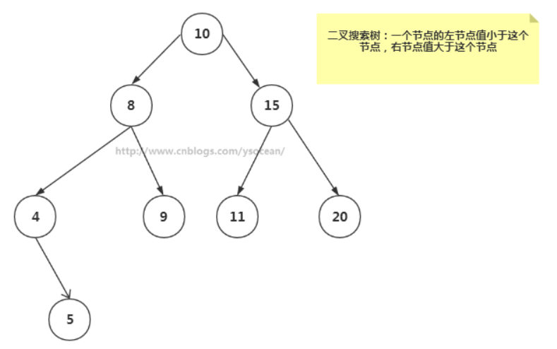
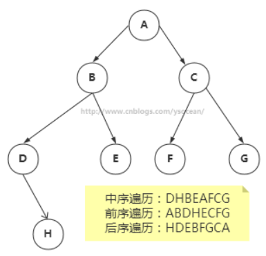

# 树

## 树的常用术语


* 路径：顺着节点的边从一个节点走到另一个节点，所经过的节点的顺序排列就称为“路径”。
* 根：树顶端的节点称为根。一棵树只有一个根，如果要把一个节点和边的集合称为树，那么从根到其他任何一个节点都必须有且只有一条路径。A是根节点。
* 父节点：若一个节点含有子节点，则这个节点称为其子节点的父节点；B是D的父节点。
* 子节点：一个节点含有的子树的根节点称为该节点的子节点；D是B的子节点。
* 兄弟节点：具有相同父节点的节点互称为兄弟节点；比如上图的D和E就互称为兄弟节点。
* 叶节点：没有子节点的节点称为叶节点，也叫叶子节点，比如上图的A、E、F、G都是叶子节点。
* 子树：每个节点都可以作为子树的根，它和它所有的子节点、子节点的子节点等都包含在子树中。
* 节点的层次：从根开始定义，根为第一层，根的子节点为第二层，以此类推。
* 深度：对于任意节点n,n的深度为从根到n的唯一路径长，根的深度为0；
* 高度：对于任意节点n,n的高度为从n到一片树叶的最长路径长，所有树叶的高度为0；

## 二叉树 二叉搜索树

* **二叉树**：
  * 树的每个节点最多只能有**两个子节点**
  * 二叉树的子节点称为“**左子节点**”和“**右子节点**”
* **二叉搜索树**：
  * 若它的左子树不空，则**左子树**上所有结点的值均**小于**它的**根结点**的值；
  * 若它的右子树不空，则**右子树**上所有结点的值均**大于**它的**根结点**的值；
  * 它的左、右子树也分别为二叉排序树。



## 查找节点

* 只能从根节点开始
* 查找值比当前节点值大,搜索右节点
* 查找的值等于当前节点的值,停止搜索
* 查找值比当前节点值小,搜索左节点

````java
public class TreeImpl implements Tree {
    public Node find(Integer key) {
        Node next= root;
        while (next!=null){
            if (next.getData()>key){//搜索值小于根节点,去左节点找
                    next = next.getLeftNode();
            }else if (next.getData()<key){
                    next = next.getRightNode();
            }else{
                return next;
            }
        }
        return null;
    }
}
````

## 插入节点

* 从根节点开始
* 大于根节点比较右节点,小于根节点比较左节点,知道左节点或者右节点为空,添加改节点
* 不能重复,重复可以在Node添加字段count,重复时count+1

```java
public boolean insert(Integer key) {
    Node newNode = new Node(key);//创建新的节点
    if (root==null){//根节点没有的话,在根节点添加
        root=newNode;
        return true;
    }

    Node nextNode = root;//根节点不为空
    //根节点有东西,比较大小,判断需要在左节点添加还是右节点,为空的话直接添加,相等的话返回false
    while (nextNode!=null){
        //判断是否相等
        if(nextNode.getData().equals(key)){//有重复值,可以选择count+1,也可以选择直接返回false,这里返回false,添加失败
            return false;
        }else if (nextNode.getData()>key){//节点值大于KEY,应该添加到左节点,为空的话直接添加,不为空的话,继续判断
            if (nextNode.getLeftNode()==null){
                nextNode.setLeftNode(newNode);
                return true;
            }
            nextNode = nextNode.getLeftNode();
        }else{
            if (nextNode.getRightNode()==null){
                nextNode.setRightNode(newNode);
                return true;
            }
            nextNode = nextNode.getRightNode();
        }
    }
    return true;
}
```

## 遍历节点

* 遍历有三种方式
  * **中序遍历**:左子树->根节点->右子树
  * **前序遍历**:根节点->左子树->右子树
  * **后序遍历**:


